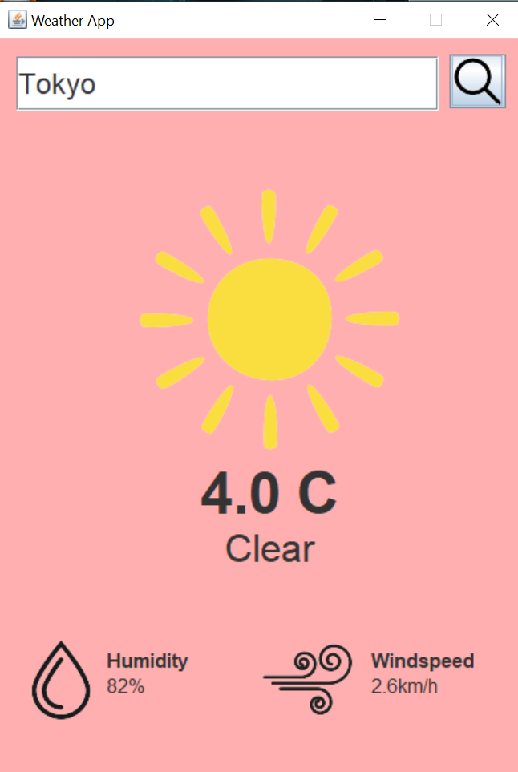

# Weather_App

## Description

Weather_App is a simple Java weather application that utilizes the Open-Meteo Weather Forecast API to provide current weather information for any valid city name entered by the user. This application returns essential weather details such as temperature, weather condition, humidity, and wind speed.

## Features

- **City Input:** Users can input any valid city name to retrieve weather information.
- **Temperature:** Provides the current temperature in Celsius.
- **Weather Condition:** Describes the current weather condition (e.g., sunny, cloudy, rainy).
- **Humidity:** Displays the percentage of humidity in the air.
- **Wind Speed:** Indicates the current wind speed in kilometers per hour (km/h).

## How to Use

1. Clone the repository to your local machine.
2. Compile the Java files using a Java compiler.
3. Run the compiled program.
4. Enter the desired city name when prompted.
5. View the weather information displayed.

